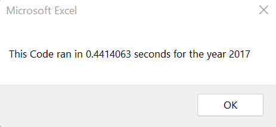
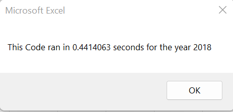
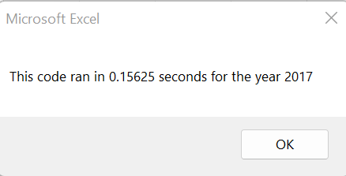
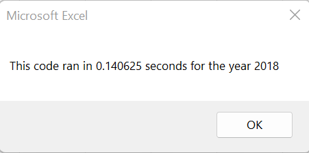

# Refoctoring of Stock Market Analysis Script

## Project Overview
Steve is helping his parents invest in green energy. His parents have made an initial investment in a company (Ticker DQ). Steve needed a way to assess how sound their investment was. To draw conclusions, Steve needed to compare DQ's performance to other publicly traded corporations invloved in the same industry.

Data was collected for 12 companies stock performance for the years 2017 and 2018 and stored in a Microsoft Excel Workbook. The quantities of interest for comparison are Total Daily Volume and the Return of each stock over the course of a year.

A program was written using VBA to perform the neccesary calculations and display the result. This initial program worked well for the relativley small dataset consisting of around 3000 rows. 

Steve would like to expand the data set to include the entire stock market. Refactoring of the initial code was performed with the goal of increasing performace to allow for easier use with larger data sets.

## Results
### Core Programatic Flow
The original and refactored program each have the same primary function: to iterate through the rows to collect the data of interest. This is accomplished in both using For loops and If statements.

To output the Total Volume and Return for each stock's ticker required:

- A cumulative sum of the Volume for each row associated with a given ticker.
- Determining the first and last value for each ticker to calculate the Return.

Finding the first and last values used a conditional check to see if the ticker name is the previous row was different for the starting value, and checking the next row for the end value.

Each program accepts user input for the year for analysis and generates a formatted output of the results with the same methods.

### Original Code

The original code used a nested For loop as its main structure. To contain the ticker names an array was used:
     
    Dim tickers(12) As String
    
    'Populate array
    tickers(0) = "AY"
    tickers(1) = "CSIQ"
    tickers(2) = "DQ"
    tickers(3) = "ENPH"
    tickers(4) = "FSLR"
    tickers(5) = "HASI"
    tickers(6) = "JKS"
    tickers(7) = "RUN"
    tickers(8) = "SEDG"
    tickers(9) = "SPWR"
    tickers(10) = "TERP"
    tickers(11) = "VSLR"

The outer For loop iterated through this array. The inner For loop iterated through each row of the target worksheet. The number of rows was found using:

    lastRow = Cells.Find(What:="*", After:=Range("A1"), SearchOrder:=xlByRows, SearchDirection:=xlPrevious).Row

The overall struture of the inner loop was as follows:

    For j = 2 To lastRow
                
                    'check if jth row contains Data for ith ticker
                    
                    If Cells(j, 1) = ticker Then
                    
                    'Find Total Volume
                    
                    totalVolume = totalVolume + Cells(j, 8).Value
                    
                        'Find start price
                    
                        If Cells(j - 1, 1).Value <> ticker Then
                    
                            startPrice = Cells(j, 6).Value
                    
                        End If
                    
                        'Find end price
                    
                        If Cells(j + 1) <> ticker Then
                            
                            endPrice = Cells(j, 6).Value
                    
                        End If
                    
                    End If
                
                
                Next j

Thus, each row was first checked to determine if it contained data for the current ticker. If so, the cumulative sum of the Volumes was continued and it was checked whether this jth row was the first or last row containing data for this ticker.

After each completion of the inner loop, the collected results were added to the output worksheet. This flow required that the data worksheet be combed through 12 times. Additionally, activating and reactivating sheets within the For loop was innefficient.

This structure is not easily scaleable to larger data sets because the the data is looped through as many times as there are tickers.

Example run times for each year are shown below:

### Refactored Code

The refactored code made two significant changes. The largest perhaps was the removal of the Nested For loop. The use of arrays for more variables made this possible.

In addition to the tickers array shown above, variables for the Total Volume, Starting Price, and Ending Price were created with the same dimensions. A data type was specified for all arrays. To avoid errors, the array for Total Volume is initialized to 0 for each index using a For loop.

The major structure for the refactored code is:

    For i = 2 To rowCount
    
        'Increase volume for current ticker
        
        'If the cell in the ith row of column A matches the ticker name for the current index
        'Then the value for the ith row is added to  the current value of tickerVolume for this
        'tickerIndex
        
        If Cells(i, 1).Value = tickers(tickerIndex) Then
            
            tickerVolume(tickerIndex) = tickerVolume(tickerIndex) + Cells(i, 8).Value
            
        End If
        
        
        'For the current tickerIndex check if the ith cell and the cell immediatley above do not have the same value
        'If this condition is met to starting price for this tickerIndex is set
        
        If Cells(i, 1).Value = tickers(tickerIndex) And Cells(i - 1, 1).Value <> tickers(tickerIndex) Then
        
            tickerStartingPrices(tickerIndex) = Cells(i, 6).Value
            
        End If
        
        'If the cell in the ith row and the row immediatley belwo have different values, the ith row is the last
        'row containing data for the ticker at this tickerIndex and the ending price is set
        
        If Cells(i, 1).Value = tickers(tickerIndex) And Cells(i + 1, 1).Value <> tickers(tickerIndex) Then
            
            tickerEndingPrices(tickerIndex) = Cells(i, 6).Value

            'tickerIndex is iterated. The evaluation of the instructions inside the If indicates the last row of
            'data for the current ticker has been colleted. Iterating the tickerIndex moves on to the next ticker
            'to evaluate the conditionals
            
            tickerIndex = tickerIndex + 1
             
        End If
    
    Next i

This structure allows for a single pass through the sheet. The conditionals within the loop evaluate in a similar manner to the original code, however, there are no nested conditionals. 

The use of arrays permits the collection of all the data of interest before adding them to the results. This streamlines the primary For loop and also the output phase.

Operating correctly, this should make a single pass through the data and is able to scale more efficiently.

Example runtimes for each year are shown below:

## Summary

### Pros and Cons of Refactoring Code

Refactoring code has several potential benifits. Refactored code is often easier to read and understand. This is especially important if a new developer begins working with the code. Reduced complexity and uneeded additions can lead to performance improvment while maintaining original functionality.

A potential downside of refactoring is the possible introduction of bugs/errors into previously functional code. For large projects the refactoring process may require a significant investment of time and money which can prevent it.

### Comparison of Original and Refactored VBA Scripts

For Steve's program refactoring was a success. While the performance improvements may not be readily evident to the user, the change to the structure will be beneficial when Steve analyzes larger data sets.

The refactoring has also cleaned up the code and potentially made it easier for another person to modify in the future and adapt to the specific task they require.
